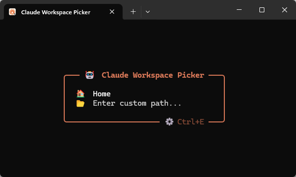

# Claude Workspace Picker

**Claude Workspace Picker** is a full-screen terminal UI for picking a workspace and launching [Claude Code](https://claude.ai/code) in it. Configure a list of project directories, select one, and Claude Code opens there immediately. Works best as a [Windows Terminal](https://github.com/microsoft/terminal) profile.



## Download

Grab the latest `ClaudeWorkspacePicker.exe` from [Releases](https://github.com/cytoph/claude-workspace-picker/releases/latest) and place it anywhere, e.g. `%LOCALAPPDATA%\ClaudeWorkspacePicker\`.

## Installation

Run with `--install-profile` to add a Windows Terminal profile automatically:

```
ClaudeWorkspacePicker.exe --install-profile
```

Re-run at any time to update the path if you move the exe.

Or add the profile manually in your Windows Terminal `settings.json`:

```jsonc
{
    "commandline": "C:\\path\\to\\ClaudeWorkspacePicker.exe",
    "guid": "{00000000-0000-0000-0000-000000000000}", // replace with a generated GUID
    "hidden": false,
    "icon": "C:\\path\\to\\ClaudeWorkspacePicker.exe",
    "name": "Claude Workspace Picker"
}
```

## Settings

On first launch, a starter `settings.jsonc` is created at `%LOCALAPPDATA%\ClaudeWorkspacePicker\settings.jsonc`. Press `Ctrl+E` inside the picker to open it directly.

You can also place a `settings.jsonc` in the same folder as the exe - it takes priority over `%LOCALAPPDATA%`, making it a portable installation.

```jsonc
{
    "background": "#ffffff",
    "foreground": "#333333",
    "boxColor": "#d77757",
    "titleIcon": "🤖",
    "titleText": "Claude Workspace Picker",
    "titleForeground": "#d77757",
    "hintForeground": "#999999",
    "selectedBackground": "#fff0e8",
    "selectedForeground": "#c05030",
    "selectedTextStyle": "bold italic",
    "globalArgs": "",
    "directories": [
        {
            "path": "%USERPROFILE%",
            "icon": "🏠",
            "displayName": "Home",
            "overrideArgs": "--dangerously-skip-permissions"
        }
    ]
}
```

**Top-level options**

All top-level options are optional. Omitted or `null` values fall back to the defaults shown below.

| Option | Default | Description |
|---|---|---|
| `background` | terminal default | Background color (hex) |
| `foreground` | terminal default | Item text color (hex) |
| `boxColor` | `"#d77757"` | Border and title color (hex) |
| `titleIcon` | `"🤖"` | Icon in the title bar |
| `titleText` | `"Claude Workspace Picker"` | Title bar text |
| `titleForeground` | same as `boxColor` | Title text color (hex) |
| `hintForeground` | darkened from `boxColor` | Hint text color (hex) |
| `selectedBackground` | same as `background` | Selected item background (hex) |
| `selectedForeground` | same as `foreground` | Selected item text color (hex) |
| `selectedTextStyle` | `"bold"` | Decoration for the selected item: `bold`, `italic`, `underline`, etc. Space-separate to combine |
| `globalArgs` | `""` | Arguments appended to every `claude` invocation, e.g. `"--dangerously-skip-permissions"` |

**Directory entries**

| Option | Required | Description |
|---|---|---|
| `path` | yes | Directory path; `%ENV_VAR%` expansion supported |
| `icon` | yes | Icon shown next to the entry |
| `displayName` | no | Label shown in the list; defaults to the folder name |
| `overrideArgs` | no | Replaces `globalArgs` for this entry; `""` to pass no arguments |

Paths that do not exist on disk are reported as configuration errors on launch.
